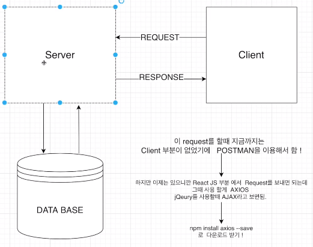

## Data Request, Response Flow 그리고 AXIOS


> client : React, Server : node.js, Database : Mongo DB
: 데이터를 보낼 때 AXIOS를 사용한다!
```
npm install axios --save
```

🤷‍♀️node 부분을 이 폴더에서 작업했다가 server로 옮기니까 backend 서버 실행할 때 파일을 찾을 수 없다고 뜨는데
경로를 바꾸어서 실행해야하는거같다 . . . 어케 하지? 막혔다 ㅠㅡㅠ