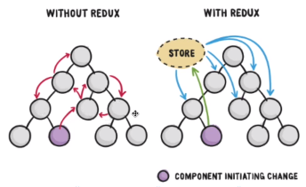

## Redux?
: 상태(state) 관리 라이브러리\
: 리덕스가 없다면 타고타고가서 전해줘야하는데 리덕스가 있으면 바로 알려줄 수 있다!
> a predictable state container


### 🍯꿀팁(Props vs State)
#### Props(Properties의 줄임말)
1. 컴포넌트간에 뭔가를 주고 받을 때 이용
2. 부모컴포넌트에서 자식컴포넌트로만 보낼 수 있다.
3. 부모컴포넌트에서 자식컴포넌트로 보낸 것은 변할 수 없다.
> 바꾸려면 부모컴포넌트에서 바꿔서 보내줘야한다.
``` jsx
<ChatMessages messages={messages} currentMember={member} />
```
#### State
1. 컴포넌트 안에서 데이터를 교환, 전달할 때 사용한다.
2. 변할 수 있기 때문에, 안에서 자유롭게 변경가능.
3. state가 변하면, re-rendering 된다.
``` jsx
state = {
    message: '',
    attachFile: undefined,
    openMenu: false,
};
```
> redux는 이러한 state를 관리해주는 툴이다.

### Redux 데이터 Flow(strict undirectional data flow)
: 한 방향으로만 흐른다.


#### Action
: 객체를 이용
``` jsx
{ type: 'LIKE_ARTICLE', articleId: 42 }
{ type: 'FETCH_USER_SUCCESS', reponse: { id:3, name: 'jun' } }
{ type: 'ADD_TODO', text: 'Read the Redux docs.' }
```

#### Reducer
: state가 action을 통해서 다른 값(?)으로 변했다는 것을 설명해준다.\
=> 이전 state와 action object를 받은 후에 next state를 return한다.
``` jsx
(previousState, action) => nextState
``` 

#### Store
: 어플리케이션의 전체 state을 감싸주는 역할.\
: 많은 method들을 이용해서 state을 관리할 수 있다.

## Redux 세팅하기
### Dependency 다운
1. redux
2. react-redux
#### redux middleware
: redux를 잘 쓰게 위해서 사용한다.
1. redux-promise
2. redux-thunk